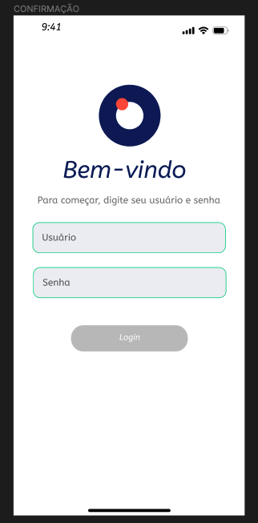
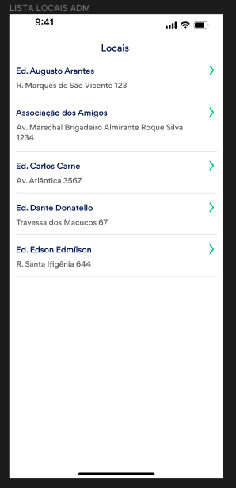
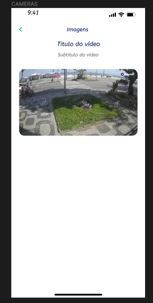

# Desafio em Flutter

Esse é o nosso desafio para você! O objetivo é você desenvolver um aplicativo que exiba alguns vídeos usando uma API e criar testes unitários. Avaliaremos seu conhecimento e habilidades nos seguintes quesitos:

- Utilização da API;
- Testes unitários;
- Arquitetura do App;

Também vamos propor que você monte algumas telas para interação com o usuário. **Lembre-se sempre que as sugestões de tela são meramente ilustrativas e a avaliação não está no design de telas ou interface.**

# Setup

Faça um Fork do projeto para a sua conta e clone-o para o seu ambiente de trabalho.

# Instruções

Depois de ter feito o Fork, crie um projeto Flutter que possibilite a uma determinada pessoa usuária fazer login na aplicação, ver uma lista de vídeos e ver um determinado vídeo.

## A API de vídeos

[Este arquivo](./mockoon/gabriel-mobile-challenge.json) contém um pequeno arquivo de mock feito com Mockoon. Você pode baixar o Mockoon [clicando aqui](https://mockoon.com/download/) e abrir o arquivo de mock. Abra o Mockoon e carregue o arquivo que você baixou.

Você poderá consumir os dados a partir da url **http://localhost:3001/v1/videos/history.** Abaixo, você verá o padrão descritivo de retorno da API:

| URL | Descrição | Status Code |
| --- | --- | --- |
| localhost:3001/v1/videos/history | uma lista de vídeos vazia | 202 |
| localhost:3001/v1/videos/history?limit=10 | uma lista de vídeos com 10 elementos | 202 |
| localhost:3001/v1/videos/history?limit=20 | uma lista de vídeos com 20 elementos | 202 |
| localhost:3001/v1/videos/history?limit=-1 | uma mensagem de não encontrado | 400 |
| localhost:3001/v1/videos/history?limit=-2 | uma mensagem de erro no servidor | 500 |

## Tela de login

Crie uma tela de login com os campos **usuário** e **senha**. 

Nesta etapa, o usuário deve ser capaz de se logar com o usuário **gabriel** e senha **140120**. Abaixo, segue uma sugestão de tela para que você possa se orientar:

## Visualização dos vídeos

Espera-se que o usuário só tenha acesso a essa tela caso ele já esteja com a autenticação feita. Nesta segunda tela, é necessário que se consuma o endpoint do arquivo mock que fornecemos. Aqui, o usuário deverá ver uma lista de locais e poderá ser capaz de acessar a visualização de vídeos como sugere a imagem abaixo:

## Visualização de um vídeo

Nessa terceira tela, mostre um player que execute o vídeo devido. Com controles de play, pause e uma barra de controle de tempo, análogo ao YouTube como segue a imagem abaixo:

# O que será avaliado

- Estrutura do projeto;
- Escrita e manutenção do código;
- Raciocínio crítico sobre o problema;

Lembre-se sempre: **simples e bem feito** é o princípio que você deve seguir.

# Sobre nós

## Squad Mobile

A Squad do aplicativo da Gabriel trabalha na construção de um aplicativo que apoia o morador protegido em qualquer lugar da Área de Proteção, integrando a Central 24h e o Camaleão, além de oferecer recursos e serviços que vão além da visualização de imagens das câmeras.

## Gabriel Tecnologia

Desenvolvemos tecnologia para atender a segurança em qualquer lugar. Nossas câmeras focalizam a rua e ajudam a prevenir roubos e furtos. Caso algo aconteça, nossa Central 24h está sempre à disposição para atender a todos e fornecer respostas.